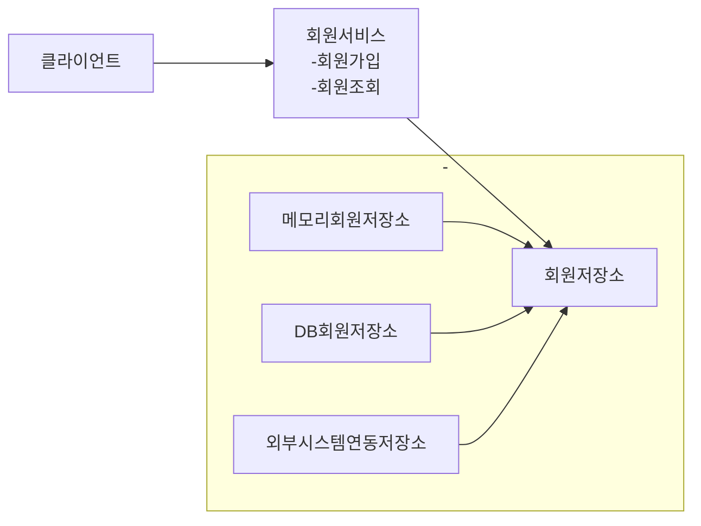
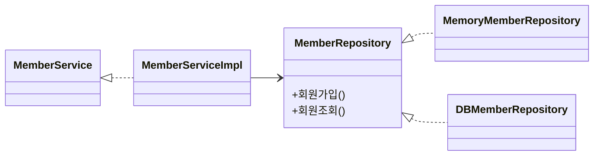

# 요구사항

- 회원
  - 회원을 가입하고 조회할 수 있다.
  - 회원은 일반과 VIP 두가지 등급이 있다.
  - 회원 데이터는 자체 DB를 구축할 수 있고, 외부 시스템과 연동할 수 있다.(미확정)
- 주문과 할인 정책
  - 회원은 상품을 주문할 수 있다.
  - 회원 등급에 따라 할일 정책을 적용할 수 있다.
  - 할일 정책은 모든 VIP는 1000원을 할인해주는 고정할인 정책을 적용한다.(추후 변경가능)
  - 할일 정책은 변경가능성이 높으며, 정책 확정은 오픈시점까지 미뤄질 예정이다.
  

# 회원 도메인

# 회원 클래스 다이어그램
